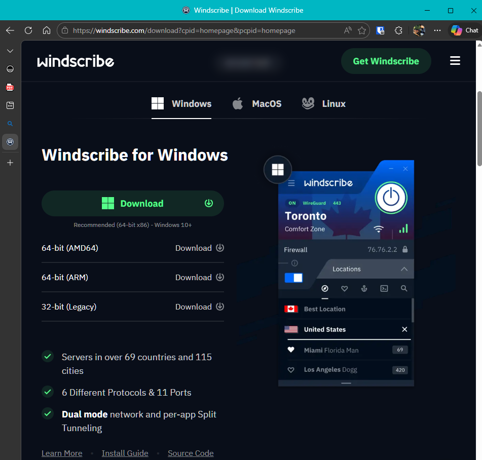
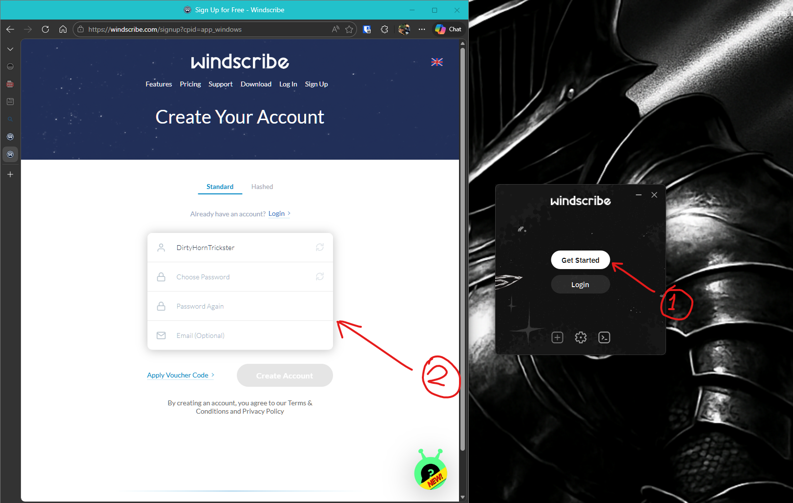
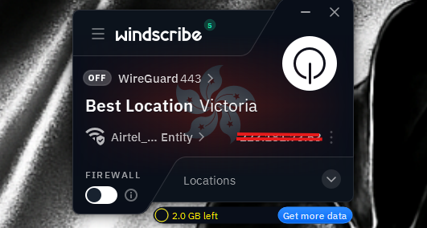
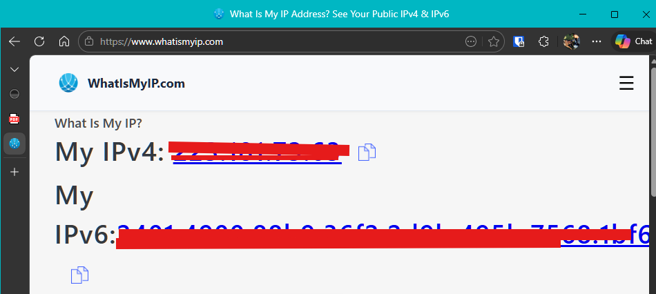
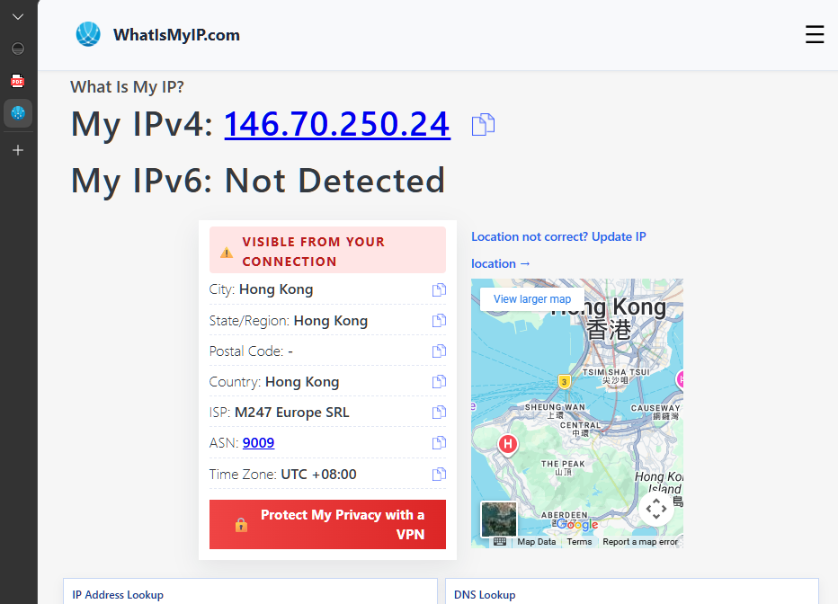

# Setting up VPN on Windows Device

## 📌 What is a VPN?
A **Virtual Private Network (VPN)** creates a secure, encrypted connection between your device and a remote server. It hides your real IP address, protects your online activity from surveillance, and allows you to access resources as if you were connected from another location.

---

## 🛠️ Setup Process

1. **Download VPN Client**  
   - Chose free VPN service **Windscribe**.  
   - Downloaded installer from official site.  
   

2. **Install & Login**  
   - Installed Windscribe and created a new account.  
   - Logged in via desktop shortcut.  
   

3. **Connect to VPN**  
   - Opened Windscribe client.  
   - Selected server location (e.g., “Identity”).  
   - Connection established with new public IP.  
   

---

## ⚙️ Configuration Options

- **Server Selection:** Choose from multiple countries, add favorites, or search specific servers.  
- **Static IP (Paid Feature):**  
  - **Pros:** Access network services remotely, avoid blacklists, restrict access to resources, better security for large networks.  
  - **Cons:** Less anonymity, easier to track, usually costs extra.  

- **Protocols & Ports:** Windscribe allows switching between protocols for performance or compatibility.  
  - **WireGuard (443, 80, 53):** Fast, modern, secure.  
    - *Pros:* High speed, strong encryption.  
    - *Cons:* May be blocked in restrictive networks.  
  - **IKEv2 (500):** Stable on mobile devices.  
    - *Pros:* Good for mobile switching between Wi-Fi/data.  
    - *Cons:* Can be blocked by firewalls.  
  - **UDP vs TCP:**  
    - *UDP:* Faster, less reliable.  
    - *TCP:* More reliable, slightly slower.  
  - **Stealth/WStunnel:** Designed to bypass censorship by disguising VPN traffic.  
    - *Pros:* Works in restrictive environments.  
    - *Cons:* Slower due to obfuscation.  

- **Firewall Feature:** Built-in kill switch blocks all traffic if VPN disconnects unexpectedly, preventing leaks.

---

## 🔍 Testing the VPN

1. **Check IP Before VPN**  
   - Visited [whatismyip.com](https://whatismyip.com).  
   - Recorded original IP.  
   

2. **Enable VPN & Verify IP**  
   - Switched VPN on.  
   - Observed new IP in Windscribe client.  
   - Refreshed site → IP/location changed.  
   

3. **Speed Test**  
   - With VPN ON: ~20 Mbps.  
   - With VPN OFF: ~30 Mbps.  
   - **Observation:** VPN slightly reduces speed due to encryption and routing overhead, but still usable.

4. **Encryption Verification (Wireshark)**  
   - Captured traffic with Wireshark while VPN active.  
   - Observed chosen protocol (WireGuard/UDP/TCP) directed to VPN server IP.  
   - Followed stream → saw gibberish characters (encrypted).  
   - Confirmed traffic is secure.

---

## ✅ Benefits of VPN
- Encrypts traffic, protecting against eavesdropping.  
- Masks real IP, enhancing privacy.  
- Allows access to geo-restricted content.  
- Provides secure remote access to corporate networks.  
- Kill switch/firewall prevents accidental leaks.  

## ⚠️ Limitations of VPN
- Reduced speed due to encryption and rerouting.  
- Free VPNs may have limited bandwidth or fewer servers.  
- VPN provider must be trusted (they can technically see traffic).  
- Some services block known VPN IPs.  
- Advanced attackers may still deanonymize users with traffic correlation.

---

## 📊 Outcome
- Successfully installed and configured **Windscribe VPN** on Windows.  
- Verified IP masking and encryption using external tools and Wireshark.  
- Demonstrated protocol switching, static IP pros/cons, and firewall feature.  
- Confirmed VPN effectiveness in securing traffic, with minor speed trade-offs.  

This project highlights practical skills in VPN setup, testing, and security validation — essential for cybersecurity awareness and professional portfolio building.

---
